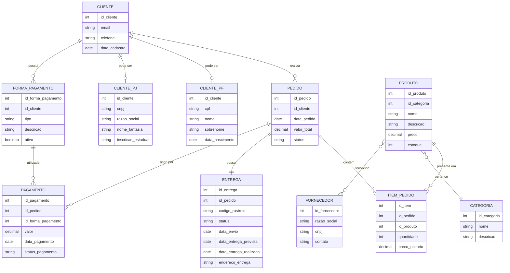

# Projeto Conceitual - Sistema de E-commerce

## Descrição do Projeto
Este é um modelo conceitual de banco de dados para um sistema de e-commerce que contempla:
- Gestão de clientes (Pessoa Física e Jurídica)
- Catálogo de produtos
- Processamento de pedidos
- Múltiplas formas de pagamento
- Rastreamento de entregas

## Modelo Entidade-Relacionamento

## Principais Entidades e Regras de Negócio

### Cliente (PF/PJ)
- Um cliente pode ser **Pessoa Física OU Pessoa Jurídica** (exclusivo)
- Implementado através de especialização/herança

### Formas de Pagamento
- Um cliente pode cadastrar **múltiplas formas de pagamento**
- Exemplos: cartão de crédito, PIX, boleto

### Entrega
- Cada pedido possui **uma entrega**
- Possui **código de rastreio** único
- **Status** da entrega (pendente, em trânsito, entregue, etc.)
